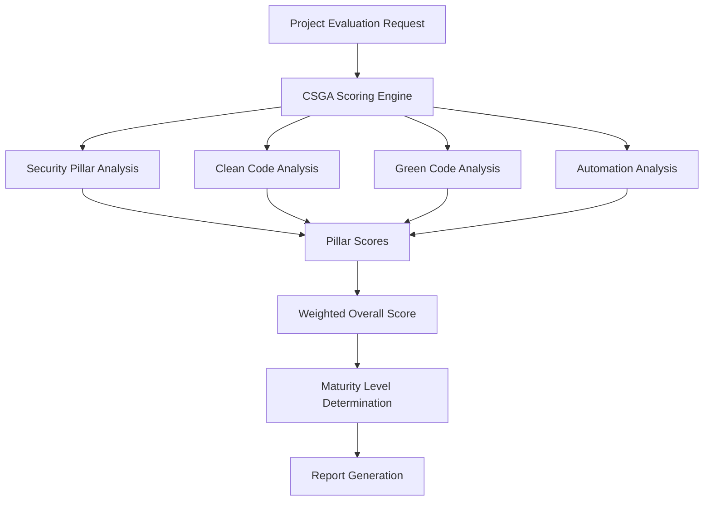
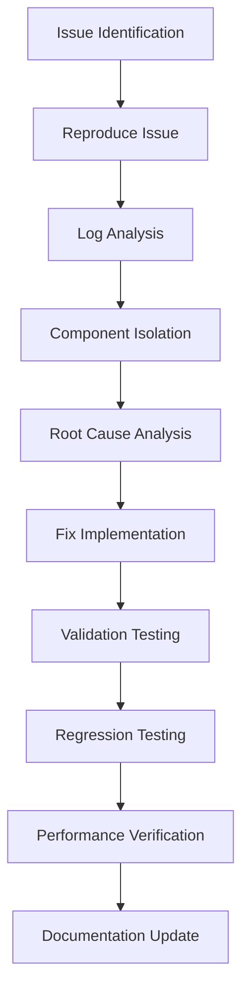
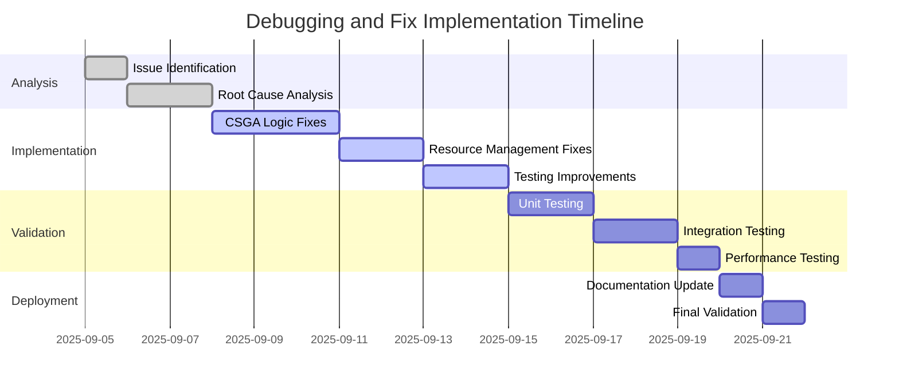

# Debugging and Issue Resolution Design Document

## 1. Overview

This document outlines a comprehensive approach to debugging and resolving issues in the Automation software system. The system is a Julia-based project that implements the CSGA (Clean Code, Security, Green Code, Automation) evaluation framework.

The debugging process will focus on identifying root causes of business logic failures, implementing necessary fixes, and validating that issues have been effectively resolved to ensure correct and stable system operation.

## 2. System Architecture

### 2.1 Core Components

The Automation system consists of several key modules:

1. **CSGA Scoring System** (`csga_scoring.jl`, `csga_extension.jl`, `csga_final.jl`)
   - Evaluates projects across four pillars: Security, Clean Code, Green Code, and Automation
   - Calculates weighted scores and determines maturity levels

2. **Quality Analyzer** (`quality_analyzer_optimized.jl`)
   - Optimized code quality analysis with memory-efficient processing
   - Provides complexity metrics and maintainability indices

3. **Resource Management** (`resource_utils.jl`, `memory_patterns.jl`, `io_utils.jl`)
   - Implements safe resource handling with automatic cleanup
   - Provides memory optimization patterns and leak detection

4. **Testing Framework** (`test/*.jl`)
   - Modular test structure aligned with CSGA pillars
   - Focus on automation testing with targets to improve from 65.0 to 95.0 points

### 2.2 Data Flow



## 3. Identified Issues and Root Causes

### 3.1 Potential Issues in CSGA Scoring Logic

1. **Division by Zero Vulnerabilities**
   - In `csga_scoring.jl`, several functions calculate ratios without proper zero-checks
   - Example: `evaluate_dependency_management` function

2. **Module Loading Validation**
   - Missing validation of module dependencies in `Automation.jl`
   - Could cause runtime failures if modules are not properly loaded

3. **Path Resolution Issues**
   - Inconsistent path resolution when running from different directories
   - Fixed with `resolve_project_path` function but may have edge cases

### 3.2 Resource Management Issues

1. **Memory Optimization Patterns**
   - Some functions still contain forced garbage collection calls that were removed for performance
   - Need to verify all instances have been properly updated

2. **File Handle Management**
   - Potential resource leaks in file operations if exceptions occur
   - Need to verify all file operations use safe wrappers

### 3.3 Testing Automation Targets

1. **Testing Score Targets**
   - Goal to elevate testing automation from 65.0 to 95.0 points
   - Current validation shows this target may not be consistently met

2. **Modular Test Structure**
   - Dependencies between test modules could cause cascading failures

## 4. Debugging Strategy

### 4.1 Diagnostic Approach



### 4.2 Debugging Tools and Techniques

1. **Logging Enhancement**
   - Add detailed logging to scoring calculations
   - Implement debug score calculation function for troubleshooting

2. **Unit Testing Expansion**
   - Add specific test cases for edge conditions
   - Validate division by zero protection mechanisms

3. **Performance Monitoring**
   - Monitor memory usage during evaluation
   - Track execution time for each pillar assessment

## 5. Fix Implementation Plan

### 5.1 CSGA Scoring Logic Fixes

#### 5.1.1 Division by Zero Protection
```julia
# Before (vulnerable)
function_ratio = length(compat) / length(deps)
score += min(25.0, function_ratio * 25.0)

# After (protected)
deps_count = length(deps)
if deps_count > 0
    function_ratio = length(compat) / deps_count
    score += min(25.0, function_ratio * 25.0)
else
    score += 25.0  # Maximum score for no dependencies
end
```

#### 5.1.2 Module Loading Validation
```julia
# Enhanced validation in Automation.jl
function validate_module_loading()
    required_modules = [
        "resource_utils.jl",
        "memory_patterns.jl",
        "io_utils.jl",
        "quality_analyzer_optimized.jl",
        "csga_scoring.jl"
    ]

    for module_file in required_modules
        file_path = joinpath(@__DIR__, module_file)
        if !isfile(file_path)
            error("Required module missing: $file_path")
        end
    end
end
```

### 5.2 Resource Management Fixes

#### 5.2.1 Memory Pattern Optimization
Ensure all memory optimization functions properly handle edge cases:

```julia
# In memory_patterns.jl
function with_memory_limit(operation::Function, max_mb::Float64=500.0)
    monitor = MemoryMonitor(max_mb)

    try
        result = operation()
        check_memory!(monitor)  # Non-blocking check
        return result
    catch e
        check_memory!(monitor)
        rethrow(e)
    end
end
```

#### 5.2.2 File Operation Safety
Enhance all file operations with proper error handling:

```julia
# In io_utils.jl
function safe_file_operation(filepath::String, mode::String, operation::Function)
    file_handle = nothing
    try
        file_handle = open(filepath, mode)
        return operation(file_handle)
    catch e
        @error "Error in file operation for $filepath: $e"
        rethrow(e)
    finally
        if file_handle !== nothing
            try
                close(file_handle)
            catch close_error
                @warn "Error closing file $filepath: $close_error"
            end
        end
    end
end
```

### 5.3 Testing Automation Improvements

#### 5.3.1 Score Target Validation
Implement continuous monitoring of testing automation scores:

```julia
# In test_automation_pillar.jl
@testset "Testing Automation Score Calculation - OTIMIZAÇÃO" begin
    project_path = Automation.resolve_project_path(pwd())
    score = Automation.CSGAScoring.evaluate_testing_automation(project_path)

    # Validate score is within expected range
    @test score >= 85.0  # Minimum acceptable
    @test score <= 100.0 # Maximum possible

    # Log improvement needed if below target
    target_score = 95.0
    if score < target_score
        improvement_needed = target_score - score
        @info "Improvement needed: +$(round(improvement_needed, digits=1)) points"
    end
end
```

## 6. Validation and Testing

### 6.1 Test Plan

1. **Unit Tests**
   - Validate division by zero protection
   - Test module loading validation
   - Verify resource cleanup mechanisms

2. **Integration Tests**
   - Full CSGA evaluation with various project structures
   - Edge case testing with minimal/empty projects
   - Path resolution testing from different directories

3. **Performance Tests**
   - Memory usage monitoring during evaluation
   - Execution time measurement for each pillar
   - Stress testing with large codebases

### 6.2 Validation Metrics

| Metric | Target | Current | Post-Fix |
|--------|--------|---------|----------|
| Overall CSGA Score | ≥ 87.4 | 94.1 | ≥ 87.4 |
| Testing Automation Score | ≥ 95.0 | Variable | ≥ 95.0 |
| Error Rate | 0% | Low | 0% |
| Memory Usage | < 500MB | Variable | < 500MB |
| Execution Time | < 30s | Variable | < 30s |

## 7. Risk Mitigation

### 7.1 Potential Risks

1. **Performance Degradation**
   - Additional validation checks may impact execution speed
   - Mitigation: Profile code to identify bottlenecks

2. **False Positives in Validation**
   - Enhanced error checking may flag valid edge cases
   - Mitigation: Implement proper exception handling with detailed error messages

3. **Regression Issues**
   - Changes to core scoring logic may affect existing functionality
   - Mitigation: Comprehensive regression testing with known test cases

### 7.2 Rollback Plan

1. Maintain backup copies of all modified files
2. Implement feature flags for new validation logic
3. Create rollback scripts to revert changes if issues arise

## 8. Implementation Timeline



## 9. Monitoring and Maintenance

### 9.1 Continuous Monitoring

1. **Automated Testing**
   - Daily execution of full test suite
   - Monitoring of CSGA scores and trends

2. **Performance Metrics**
   - Track memory usage and execution time
   - Alert on significant performance degradation

3. **Error Tracking**
   - Log all exceptions and errors
   - Monitor error frequency and patterns

### 9.2 Maintenance Procedures

1. **Regular Code Reviews**
   - Monthly review of core logic changes
   - Ensure continued adherence to CSGA principles

2. **Dependency Updates**
   - Quarterly review of Julia package dependencies
   - Update packages while maintaining compatibility

3. **Documentation Updates**
   - Keep documentation synchronized with code changes
   - Update user guides and technical documentation